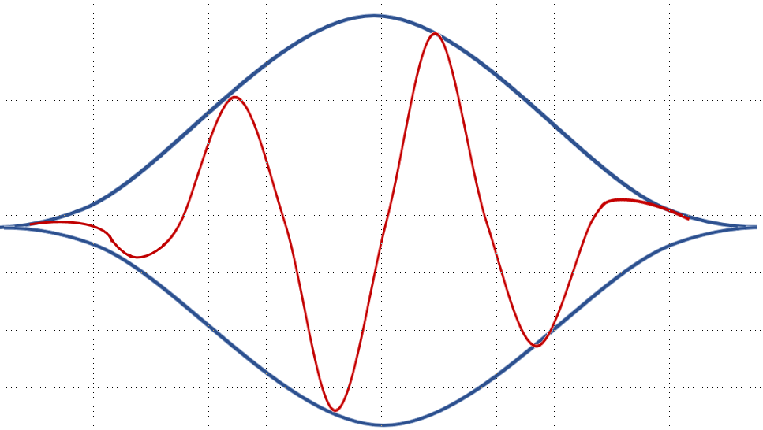

# arduino-fft

Uses an iterative implementation of the Fast Fourier Transform in order to save space in memory while not losing accuracy. Uses the Blackman-Harris windowing function to minimize spectral leakage.

## Setup
1. Create the directory `FFT` in your `Arduino/libraries` directory
2. Copy the `FFT.h` and `FFT.cpp` files into this folder

## How to use it
1. Instantiate an FFT object
```c++
FFT fft = FFT(SAMPLES, SAMPLING_FREQUENCY);
```
2. Initialize the FFT with the real and imaginary inputs
```c++
fft.updateSamples(real, imag);
```
Note here that `real` and `imag` are `double` type arrays. They must have 2^n elements in the array, where n is a positive integer. If using this on a sampled signal, the `real` array should be populated with the sampled signal values and the `imag` array should be left blank

3. Remove DC (Optional)
```c++
fft.removeDC();
```
This works by finding the average of your signal and subtracting it from each of the sampled points. It is assumed that the average is a good enough representation of the DC offset.

4. Apply the window (optional, but recommended for real sampled signals)
```c++
fft.window();
```
This applies the Blackman-Harris window to remove spectral leakage. More on this in **Importance of Windowing Functions** section.

5. Compute the FFT
```c++
fft.compute();
```
This gives raw FFT data as a complex output. Often, you only care about the magnitudes of the respective frequencies and the phase of signal in the frequency domain is not as desirable. The next step allows you to easily compute the magnitudes

6. Compute the magnitudes of each frequency bin
```c++
fft.getMags();
```
The magnitudes of each complex number in each frequency bin are now stored back in the `real` array. This is representation of the amplitude of each frequency present in the signal

## Importance of Windowing Functions
Often, when real-life signals are sampled, they are not in an ideal form for the Fourier transorm. Ideally, The beginning of the sampled section of the signal would match up with the end of the sampled section. This is because in order to calculate the frequencies within the signal, the signal needs to be periodic, so the FFT repeats the sampled section of the signal to infinity. If the start and end do not match, there will be a discontinuous jump which needs to be accounted for with unwanted frequencies. This results in spreading out of the frequency plot called spectral leakage.

Spectral leakage (no window): 

In order to minimize spectral leakage, you must force the ends of the sampled signal to meet. In order to accomplish this without having a discontinuous jump, a windowing function is applied. A windowing function forces the amplitude of the signal to be within the window. The window then gradually tapers off and pinches at the end, forcing the ends of the signal to 0, thus ensuring the ends match up. Of course, this still alters the signal, but not as much as a large jump, thus minimizing spectral leakage.

Effect of windowing function on signal: 


Spectral Leakage with Blackman-Harris window:


## Accuracy of the FFT
The FFT is as accurate as possible for the amount of data given and the given sampling frequency. The frequency resolution (difference in frequency between subsequent bins) is determined by the following relationship:

**frequency resolution = sampling frequency/number of samples**

## Further information on Fourier Transforms
More information on Fourier Series and Transforms can be found in my video: https://youtu.be/q-EZngg538M
